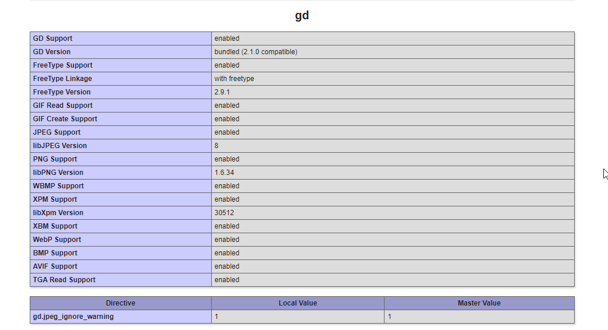

# Модуль 24. MVC. Практическая работа.

## Техническое задание.
* Воспроизведите MVC-архитектуру согласно полученным знаниям, на примере сайта визитки – 5 баллов
Можно использовать шаблонизатор TWIG. 

* Подключите пакет php-gd, прикрепить скрин о его подключении (phpinfo) – 10 баллов

* Реализуйте в вашем приложении несколько статических страниц (“О нас», «Контакты» и т.д.) – 20 баллов

## Скрин подключенной библиотеки php-gd.

### Используемые технологии
* HTML
* CSS
* PHP